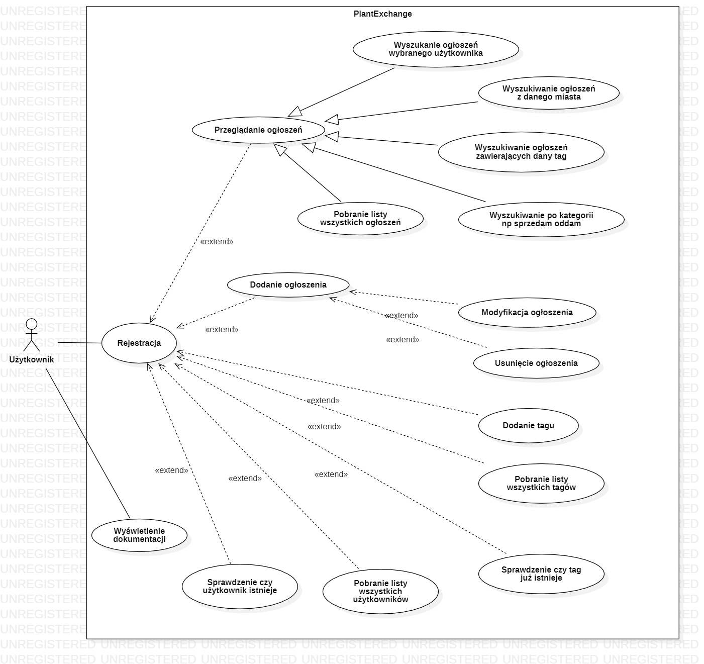

## Witaj w aplikacji Plant Exchange

Plant Exchange to aplikacja, która umożliwia użytkownikom wymianę, sprzedaż i oddawanie roślin doniczkowych. Dodawane przez użytkowników ogłoszenia zawierają m.in. informacje o danej roślinie, zdjęcia, lokalizację, a także tagi, które ułatwiają użytkownikom wyszukiwanie interesujących ogłoszeń. Tagi mogą dotyczyć gatunku rośliny, jej rozmiaru, stanu czy innej charakterystyki.

* * *

### Dokumentacja API

* * *

#### Rejestracja i uwierzytelnianie

Niezalogowany użytkownik ma dostęp jedynie do strony głównej "/". Aby korzystać z API należy się zarejestrować, wysyłając zaprezentowany poniżej formularz rejestracyjny w formie JSON metodą HTTP POST na adres /register.

{ "email": "test123@test.pl", "password": "abcabc" }

Pole "email" powinno zawierać poprawny adres email o długości nie mniejszej niż 4 i nie większej niż 64. Nie może być to email konta, które już istnieje w aplikacji.

Pole "password" powinno zawierać ciąg znaków o długości nie mniejszej niż 6 i nie większej niż 32.

Rejestracja może zakończyć się z następującymi kodami odpowiedzi:

*   202 Accepted - rejestracja się powiodła i nowy użytkownik został zapisany do bazy danych
*   400 Bad Request - błąd w formularzu rejestracyjnym lub przy zapisie do bazy danych, należy zapoznać się z treścią wiadomości zwrotnej

#### Endpointy REST API

Requesty mogą zostać przetworzone z następującymi kodami odpowiedzi:

*   200 - żądanie zostało poprawnie sformułowane
*   400 - żądanie zawiera błędy (np. niepoprawny typ danych, niepoprawne parametry url, brakujące elementy żądania)
*   403 - odmowa dostępu, żądanie może zostać przetworzone tylko przez autora danego ogłoszenia

#### /plant-offers

Endpoint /plant-offers umożliwia zalogowanym użytkownikom na pobranie listy ogłoszeń wg wybranych kryteriów, dodać nowe ogłoszenie lub zaktualizować bądź usunąć stworzoną wcześniej przez niego ogłoszenie.

*   **GET /plant-offers**

    Zwraca wszystkie istniejące w aplikacji ogłoszenia

*   **GET /plant-offers/{id}**

    Zwraca ogłoszenie o podanym id lub pustą odpowiedź, jeśli dane ogłoszenie nie zostało znalezione. Id jest typu Integer.

*   **GET /plant-offers/?city={city}&category={category}&tags={list-of-tags}**

    Możliwe jest skorzystanie z trzech parametrów url. "City" umożliwia wyszukiwanie ogłoszeń po nazwie miasta. "Category" umożliwia wyszukiwanie po kategorii ogłoszenia. Dostępne kategorie to "SELL", "EXCHANGE", "GIVE_AWAY", "LOOK_FOR". Parametr "tags" umożliwia wyszukiwanie po dowolnej liczbie tagów, które należy rozdzielić przecinkiem.

*   **POST /plant-offers**

    Dodaje nowe ogłoszenie. To żądanie wymaga dostarczenia JSONa z zawartością ogłoszenia. Ogłoszenie może zawierać pola:

    {"category": SELL | GIVE_AWAY | LOOK_FOR | EXCHANGE,  
    "title": string,  
    "description": string,  
    "price": numeric,  
    "photos": string[],  
    "tags": string[],  
    "city": string }

    Obowiązkowe są pola category i title. W polu tags powinny się znaleźć nazwy istniejących już tagów. Serwer zwraca obiekt utworzonego ogłoszenia.

*   **DELETE /plant-offers/{id}**

    Usuwa ogłoszenie o podanym id, żądanie może zgłosić jedynie zalogowany autor ogłoszenia.

*   **PUT /plant-offers/{id}**

    Zmienia ogłoszenie o podanym id na taką jak w przesłanym obiekcie w formie JSON. Pola "category", "title", "description", "photos", "tags", "price", "city" zostaną zastąpione podanymi przez użytkownika. Pola takie jak data utworzenia czy autor nie ulegają zmianie. Zmiany ogłoszenia może dokonać tylko autor.

#### /tags

Endpoint /tags umożliwia zalogowanym użytkownikom na pobranie listy tagów dostępnych w aplikacji, a także dodanie nowych.

*   **GET /tags**

    Pobiera listę wszystkich dostępnych tagów.

*   **GET /tags/{name}**

    Jeżeli tag o podanej nazwie istnieje, zwraca go.

*   **POST /tags**

    Dodaje nowy tag. W żądaniu należy umieścić następujący JSON:

    { "name": string }

    Serwer zwraca obiekt utworzonego tagu.

#### /users

Endpoint /users pozwala na pobranie listy zarejestrowanych użytkowników, a także pobranie ogłoszeń dodanych przez konkretnego użytkownika.

*   **GET /users**

    Zwraca listę zarejestrowanych użytkowników. Dane te obejmują jedynie adresy e-mail, będące loginami w aplikacji.

*   **GET /users/{email}**

    Jeżeli użytkownik o podanym adresie email posiada konto w aplikacji, serwer zwraca obiekt tego użytkownika.

*   **GET /users/{email}/offers**

    Zwraca wszystkie oferty utworzone przez użytkownika o podanym adresie email.

